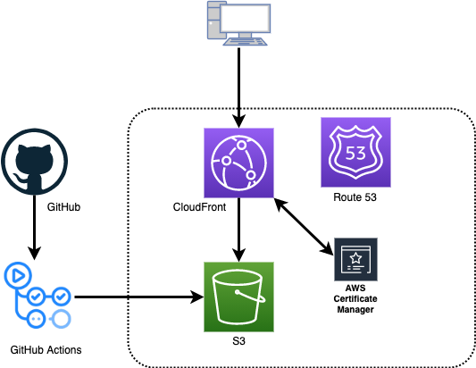

## a

### [AWSを利用したブログ構築 - tech-blog.s-yoshiki.com](https://tech-blog.s-yoshiki.com/)

 - AWS のサービスを活用した [ブログ(https://tech-blog.s-yoshiki.com/)](https://tech-blog.s-yoshiki.com/) およびCI/CDの構築 
 - AWS / S3 / CloudFront / GitHub Actions / Gatsby / React

### JavaScriptによる画像処理 - 画像処理100本ノックJS

 - 画像処理100本ノックに出てくるアルゴリズムをJSで0から実装しました。 
 - JavaScript / Vue / Canvas
 - [DEMO (https://s-yoshiki.github.io/Gasyori100knockJS/#/list)](https://s-yoshiki.github.io/Gasyori100knockJS/#/list)