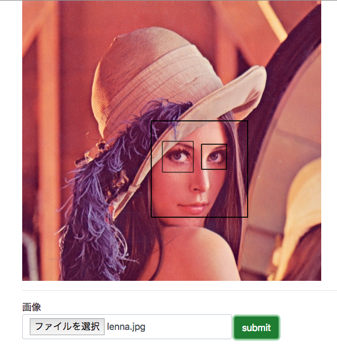

## 概要

「顔検出をして、顔に絵を描く」というもの。

具体的には、
顔写真の画像をAPIサーバへアップロードし、顔検出を行う。
サーバは顔座標を返し、それを元にcanvasでお絵かきする。

## 環境

##### フロント

html + JS + canvas
axios.jsでAPIを叩く

##### サーバ

- Ubutnu 16.04
- Python + Flask
- OpenCV 3.2
など

## アプリケーション



こんな感じになる。
とりあえず、顔に枠線を書いている。
画像の描画、顔へのお絵かきは全てJSで実装。
サーバ側は顔検出するだけ。

下記にソース。

## フロント

ファイルが選択されたら、canvasに画像を描画。
ボタン押下時にPOST。

html

```html
<html>
    <head>
        <script src="https://cdnjs.cloudflare.com/ajax/libs/axios/0.18.0/axios.js"></script>
    </head>
    <body>
        <div class="container">
            <canvas id="canvas"></canvas>
            
            <label>
                画像
                <input type="file" class="form-control" id="image">
            </label>
            <button id="run">
                submit
            </button>
        </div>
        <script src="index.js">
        </script>
    </body>
</html>
```

js

```js
(function(){

    document.getElementById("run").addEventListener("click", function(){
        var params = new FormData();
        var file = document.getElementById("image").files[0]

        params.append('image', file)
        axios.post('/api', params).then(function(response) {
            response.data.forEach((e) => {
                var v = e.face
                drawRect(v.x, v.y, v.w, v.h)
                e.eyes.forEach((eye) => {
                    eye.x += v.x
                    eye.y += v.y
                    drawRect(eye.x, eye.y, eye.w, eye.h)
                })
            })
        }).catch(function(error) {
            alert("error")
        });
    })

    document.getElementById("image").addEventListener("change", function(e) {
        var file = e.target.files;
        var reader = new FileReader();
        reader.readAsDataURL(file[0]);
        reader.onload = function() {
            var source = reader.result;
            drawImage(reader.result)
        }
    }, false);

    function drawImage(src) {
        var canvas = document.getElementById("canvas")
        var context = canvas.getContext('2d')
        var image = new Image()
        image.src = src;
        image.onload = function() {
            canvas.width = image.width
            canvas.height = image.height
            context.drawImage(image, 0, 0)
        }
    }

    function drawRect(x, y, w, h) {
        var canvas = document.getElementById("canvas")
        var context = canvas.getContext('2d')
        context.rect(x, y, w, h);
        context.stroke();
    }
})()

```

## サーバ

サーバはPython + Flaskで実装。
顔画像処理はOpenCV、numpyで実装。

<a href="https://docs.opencv.org/3.4/d7/d8b/tutorial_py_face_detection.html">サンプル</a>
index.py

```py
import os,sys
from flask import Flask, render_template, request, jsonify
from jinja2 import FileSystemLoader
import base64

from face_detect import get_facepos

app = Flask(__name__)

app.config['MAX_CONTENT_LENGTH'] = 1 * 1024 * 1024
app.config['UPLOAD_FOLDER'] = './tmp'

@app.route("/", methods=['GET'])
def get_index():
    return render_template('index.html')

@app.route("/api", methods=['POST'])
def face_detect():
    img = request.files['image']
    name = img.filename
    path = os.path.join(app.config['UPLOAD_FOLDER'], name)
    img.save(path)
    face_pos = get_facepos(path)
    return jsonify(face_pos)

```

face_detect.py

```py
import numpy as np
import cv2

def get_facepos(img_path):
    face_cascade = cv2.CascadeClassifier('/path/to/haarcascade_frontalface_default.xml')
    eye_cascade = cv2.CascadeClassifier('/path/to/haarcascades/haarcascade_eye_tree_eyeglasses.xml')

    img = cv2.imread(img_path)
    gray = cv2.cvtColor(img, cv2.COLOR_BGR2GRAY)
    faces = face_cascade.detectMultiScale(gray, 1.3, 5)

    result = []
    for (x,y,w,h) in faces:
        face_dst = {
            "x": np.asscalar(x),
            "y": np.asscalar(y),
            "w": np.asscalar(w),
            "h": np.asscalar(h)
        }
        eyes_dst = []
        roi_gray = gray[y:y+h, x:x+w]
        eyes = eye_cascade.detectMultiScale(roi_gray)
        for (ex,ey,ew,eh) in eyes:
            eye_pos = {
                "x": np.asscalar(ex),
                "y": np.asscalar(ey),
                "w": np.asscalar(ew),
                "h": np.asscalar(eh)
            }
            eyes_dst.append(eye_pos)
        result.append({
            "face": face_dst,
            "eyes": eyes_dst
        })
    return result

```

ディレクトリ構成

```/
├── face_detect.py
├── index.py
├── templates
│   └── index.html
└── tmp
    └── lenna.jpg 
```

## 参考

<a href="https://qiita.com/s-yoshiki/items/d4a460b2ab56e72220b9">【Python】顔画像をPOST 、 顔検出 、 canvasで顔にお絵かき【JS】</a>