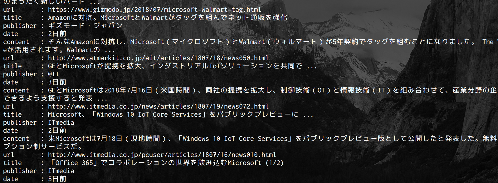

## 概要

スクレイピングで任意のキーワードのニュース一覧を取得する方法を紹介します。
例えば「キーワード = apple」だとしたら、appleのニュースの一覧を取得します

例えばこんな感じで。



## 環境

Python3.6
urllib
BeautifulSoup

macOSX 10..

## 実装

### モジュール

上記にもあるようにこれらのモジュールを使います。

```py
import urllib.request, urllib.parse
from urllib.parse import urlparse
import bs4
import re

```

### リクエストURL

例えば「aws」とニュース検索した時のURLはこのようになります。

```
http://www.google.co.jp/search?safe=off&client=ubuntu&channel=fs&hl=ja&biw=1920&bih=984&tbm=nws&ei=M7wKW53oIsPJ0ASYxbpo&q=aws&oq=aws
```

ここでgetパラメータ「q」「op」は検索キーワード、「tbm」は検索種別といった具合に読み取るれると思います。
これを使ってスクレイピングしていきます。

### クエリ作成

↓この関数でリクエストURLを作成し、パースしたhtmlオブジェクトを返却します。
<div style="font-size:13px !important;">

```py
def getGoogleNewsSite(search, term='q'):
headers = {'User-agent':'Mozilla/11.0'}
  url = "http://www.google.co.jp/search?safe=off&channel=fs&hl=ja&tbm=nws&tbs=qdr:"+term+"&q="+urllib.parse.quote(search)+"&oq="+urllib.parse.quote(search)
  req = urllib.request.Request(url,None,headers)
  return bs4.BeautifulSoup(urllib.request.urlopen(req).read(), "html.parser")

```

</div>

### ニュース情報抽出

パースされたオブジェクトからコンテンツの内容を抽出します。

```py
def getNewsList(html) :
d_list = html.find_all("div", class_="g")
result = []

for val in d_list :
  # URL
  url = val.find('a').get('href')
  data = urlparse(url)
  q = urllib.parse.parse_qs(data.query)
  target_url = q['q'][0]

  # title
  text = val.find('a').text
  text = text.replace("\xa0", '')

  # content
  contents = val.find('div', class_="st").text

  # publication
  data = val.find("span", class_="f").text
  data = data.replace("\u200e", "")
  data = data.split("-")
  date = ''
  pub = ''

  if len(data) == 2 :
    pub = data[0]
    date = data[1]
    date = date.replace(" ","")

  news = {
    'url' : target_url,
    'title' : text,
    'publisher' : pub,
    'date' : date,
    'content' : contents
  }
  result.append(news)

return result

```

### 実行

```py
if __name__ == "__main__" :
  query = urllib.parse.quote("keyword")
  html = getGoogleNewsSite(query)
  result  = getNewsList(html)

```

こんな感じで使います。
リスト化してしまいましょう。

```py
if __name__ == "__main__" :
  keywords = [
    "Amazon", "google", "Apple", "Microsoft"
  ]

  for i in keywords :
    query = urllib.parse.quote("keyword")
    html = getGoogleNewsSite(query)
    result  = getNewsList(html)

  for j in r :
  if re.search('[あ-んア-ン]', j['title']) is not None :
    print('url       : ' + j['url'])
    print('title     : ' + j['title'])
    print('publisher : ' + j['publisher'])
    print('date      : ' + j['date'])
    print('content   : ' + j['content'])

```

12行目の

```
if re.search('[あ-んア-ン]', j['title']) is not None :
```

で日本語以外のニュースを弾いています。
これを実行すると,,,↓のように取得できました。

```
url       : https://www.gizmodo.jp/2018/07/apple-autodrive-test.html
title     : Appleの自動運転プロジェクト、ますます増強されてます
publisher : ギズモード・ジャパン
date      : 1日前
content   : もはや、珍しくない存在に？ 今年に入ってから、何度も規模拡大が伝えられてきたApple（アップル）の自動運転プロジェクト。現在、自動運転車のテスト走行が66台の車両と111人のドライバーにまで増強されているんだそうです。
url       : https://www.gizmodo.jp/2018/07/siri-apple-leftnoone.html
title     : Siri生みの親、初期メンバーの最後のひとりがAppleを去る
publisher : ギズモード・ジャパン
date      : 1日前
content   : Siriといえば、Apple（アップル）。でも、そもそもはSRI International（SRIインターナショナル）という非営利団体が人工知能研究のスピンオフプロジェクトとして開発したのが始まり。ここを、2010年にAppleが買収しました。買収後、元からいた...
url       : https://iphone-mania.jp/news-219590/
title     : 未来のApple Watchには日焼け防止機能が追加可能になる！？
publisher : iPhone Mania
date      : 23時間前
content   : Apple Watchには、健康管理に役立つ機能が今後さらに追加される見通しですが、現在の肌の露出状況をチェックして、日焼けしないよう通知してくれる機能も導入されるかも知れません。
url       : https://www.gizmodo.jp/2018/07/macbook-pro-keyboard-renew.html
title     : Apple内部資料から判明。MacBook Proのキーボード改良は故障対策 ...
publisher : ギズモード・ジャパン
date      : 1日前
content   : MacRumorsが入手したApple（アップル）の認定サービスプロバイダ向けの内部資料によれば、この第3世代バタフライキーボードの内部には｢メンブレン（膜）｣が搭載されており、またその目的に｢ゴミがバタフライメカニズムに侵入することを防ぐ...
url       : https://robotstart.info/2018/07/20/apple-siri-cofounder-tom-gruber.html
title     : Siriの開発責任者Tom Gruber氏がAppleを退社 Siri社創業メンバー最後 ...
publisher : ロボスタ
date      : 1日前
content   : Tom Gruber氏は、2007年創業のSiri社のCTOかつVP Designを担当していた。2010年にAppleに買収されてからも継続してSiriの開発責任者として携わってきた人物だ。他の創業メンバーは数年前にAppleを退社しておりGruber氏が最後の...
url       : https://jp.techcrunch.com/2018/07/18/2018-07-17-apples-icloud-user-data-in-china-is-now-handled-by-a-state-owned-mobile-operator/
title     : AppleのiCloudの中国のユーザーはオプトアウトしないかぎりデータを ...
publisher : TechCrunch Japan
date      : 3日前
content   : Appleのデータが同社のアメリカのサーバーから中国のサーバーへ移行することは、中国政府が個人や企業の微妙なデータに容易にアクセスできることを意味する、という大きな懸念がある。その発表の前には、中国のユーザーの暗号鍵も...
url       : https://wired.jp/2018/07/21/microsoft-surface-go/
title     : マイクロソフトは「Surface Go」で、教育市場に食い込めるか
publisher : WIRED.jp
date      : 3時間前
content   : 「Surface Go」はマイクロソフトが教育市場を狙って繰り出した最新の一手だ。10型タブレットの教育機関向けモデルの販売価格は399ドル（日本では47,800円）からで、これまでの下位モデルの価格を大きく下回る。例えば「Surface Pro」...
url       : https://jp.reuters.com/article/microsoft-results-idJPKBN1K934F
title     : マイクロソフト、4  6月業績は予想上回る クラウド大幅増収
publisher : ロイター
date      : 1日前
content   : ［１９日 ロイター］ - 米マイクロソフト(MSFT.O)の第４・四半期（４─６月）決算は、クラウドコンピューティングサービス「アジュール」やクラウド型業務ソフト「オフィス３６５」に対する企業の需要が拡大し、売上高と利益が市場予想を上回った。

```

## 他

プロキシ環境では↓を使います。

```py
proxies = {'http' : 'hogehoge.co.jp'}
proxy = urllib.request.ProxyHandler(proxies)
opener = urllib.request.build_opener(proxy)
urllib.request.install_opener(opener)

```
