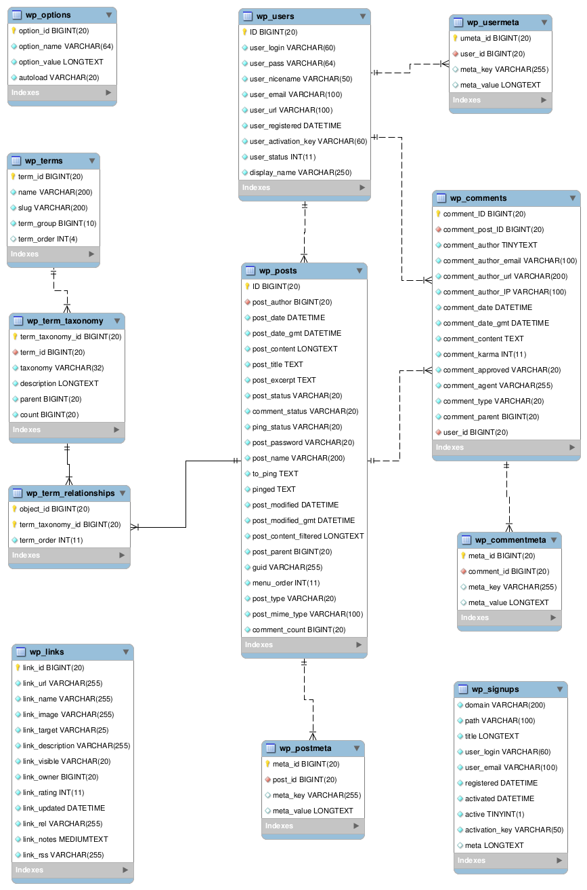

## 概要

WordPressにため込んだデータMarkdown化しGatsbyで作ったブログに引越しするために記事データを抽出した時のSQLの話。

かなり泥臭かったです。

## WordPressのDB関連図

WordPressのDBの関連図は次のようになっています。画像は基本的なテーブルです。



実際に実行したのはこちらのテーブル。

プラグイン依存のテーブルがありますが、これは無視していきます。

```
+-----------------------------+
| Tables_in_bitnami_wordpress |
+-----------------------------+
| wp_aiowps_events            |
| wp_aiowps_failed_logins     |
| wp_aiowps_global_meta       |
| wp_aiowps_login_activity    |
| wp_aiowps_login_lockdown    |
| wp_aiowps_permanent_block   |
| wp_as3cf_items              |
| wp_cocoon_accesses          |
| wp_cocoon_affiliate_tags    |
| wp_cocoon_function_texts    |
| wp_cocoon_item_rankings     |
| wp_cocoon_speech_balloons   |
| wp_commentmeta              |
| wp_comments                 |
| wp_links                    |
| wp_options                  |
| wp_postmeta                 |
| wp_posts                    |
| wp_term_relationships       |
| wp_term_taxonomy            |
| wp_termmeta                 |
| wp_terms                    |
| wp_urls                     |
| wp_usermeta                 |
| wp_users                    |
+-----------------------------+
```

このデータベースからタイトル・記事データ・サムネイル・カテゴリ・タグを抽出していきます。

## 公開記事一覧の取得

WordPressのタイトル・記事内容の情報は`wp_posts`に格納されていますが、画像データなど様々な物が含まれているので、フィルターをかけて抽出します。

実際のクエリはこちら

```SQL
SELECT 
  * 
FROM
  wp_posts
WHERE 
  post_status = 'publish'
  AND 
  post_title <> ''
```

取得できたデータはこちら。IDが主キーとなります。

```
*************************** 1. row ***************************
                   ID: 5
          post_author: 3
            post_date: 2018-01-22 12:15:57
        post_date_gmt: 2018-01-22 12:15:57
         post_content: '略: 本文本文本文本文本文本文'
           post_title: '略: タイトルタイトルタイトルタイトル'
         post_excerpt: 
          post_status: publish
       comment_status: closed
          ping_status: open
        post_password: 
            post_name: hello-world
              to_ping: 
               pinged: 
        post_modified: 2019-01-14 17:52:46
    post_modified_gmt: 2019-01-14 08:52:46
post_content_filtered: 
          post_parent: 0
                 guid: http://0.0.0.0/?p=5
           menu_order: 0
            post_type: post
       post_mime_type: 
        comment_count: 0
```

## タグ・カテゴリの取得

タグやカテゴリは、これらを管理する`wp_term_taxonomy`と記事IDに紐つく連関エンティティ `wp_term_relationships` を利用して取得します。

**wp\_term\_relationships**

```
+------------------+---------------------+------+-----+---------+-------+
| Field            | Type                | Null | Key | Default | Extra |
+------------------+---------------------+------+-----+---------+-------+
| object_id        | bigint(20) unsigned | NO   | PRI | 0       |       |
| term_taxonomy_id | bigint(20) unsigned | NO   | PRI | 0       |       |
| term_order       | int(11)             | NO   |     | 0       |       |
+------------------+---------------------+------+-----+---------+-------+
```

**wp\_term\_taxonomy**

```
+------------------+---------------------+------+-----+---------+----------------+
| Field            | Type                | Null | Key | Default | Extra          |
+------------------+---------------------+------+-----+---------+----------------+
| term_taxonomy_id | bigint(20) unsigned | NO   | PRI | NULL    | auto_increment |
| term_id          | bigint(20) unsigned | NO   | MUL | 0       |                |
| taxonomy         | varchar(32)         | NO   | MUL |         |                |
| description      | longtext            | NO   |     | NULL    |                |
| parent           | bigint(20) unsigned | NO   |     | 0       |                |
| count            | bigint(20)          | NO   |     | 0       |                |
+------------------+---------------------+------+-----+---------+----------------+
```


クエリ

```sql
select 
    term_taxonomy.taxonomy,
    terms.name
from wp_posts posts
    inner join wp_term_relationships term_relationships 
    on posts.id = term_relationships.object_id 
    inner join wp_term_taxonomy term_taxonomy 
    on term_relationships.term_taxonomy_id = term_taxonomy.term_taxonomy_id 
    inner join wp_terms terms 
    on term_taxonomy.term_id = terms.term_id 
where 
    posts.ID = :id 
```


```
+----------+-----------------------+
| taxonomy | name                  |
+----------+-----------------------+
| category | Web                   |
| post_tag | HTML                  |
| post_tag | CSS                   |
| post_tag | JavaScript            |
| post_tag | canvas                |
+----------+-----------------------+
```

カテゴリとタグを取得できました。

## サムネイルの取得

サムネイルのデータは　`wp_posts` に格納されています。

```sql
select 
    thumbnail.guid as url
from wp_posts posts
    inner join wp_postmeta postmeta 
    on posts.ID = postmeta.post_id 
    inner join wp_posts thumbnail 
    on postmeta.meta_value = thumbnail.ID 
where 
    posts.ID = :id
    AND
    postmeta.meta_key = '_thumbnail_id'
```

ただし、画像の管理に関して様々なプラグインを利用しており、
結局目的の情報は取得できなかったので自分のブログに対しスクレイピングで画像を1件ずつ取得する方法にしました。

## おまけ: PHPスクリプト化しました

記事データをmarkdownに吐くphpスクリプトを書きました。

```php
<?php
define('DB_HOST', 'localhost:3306');
define('DB_NAME', '');
define('DB_USER', '');
define('DB_PASSWORD', '');
define('DB_CHARSET', 'utf8');

try {
    $dbh = new PDO(
        sprintf(
            "mysql:dbname=%s;host=%s;charset=%s;",
            DB_NAME,
            DB_HOST,
            DB_CHARSET
        ),
        DB_USER,
        DB_PASSWORD
    );
} catch (PDOException $e) {
    echo "connect fail: " . $e->getMessage() . "\n";
    exit(1);
}

$items = getItems();

$ignoreTags = ['web &amp; programming'];
$counter = 0;
$pathList = [];
foreach ($items as $row) {
    $id = $row['ID'];
    $taxonomy = getTagsById($id);
    $tags = [];
    foreach ($taxonomy as $tag) {
        $tag = mb_strtolower($tag['name']);
        if (in_array($tag, $ignoreTags)) {
            continue;
        }
        $tags[$tag] = 1;
    }
    $tags = array_keys($tags);
    $thumbnail = '';
    // note: DBから画像が取得できる場合
    // $thumbnail = getThumbnailById($id);
    // if (count($thumbnail) > 0) {
    //     $thumbnail = $thumbnail[0]['url'];
    // } else {
    //     $thumbnail = '';
    // }

    $oldPath = sprintf(
        "/%s/%s/%s/",
        substr($row['post_date'], 0, 4),
        substr($row['post_date'], 5, 2),
        $id
    );
    try {
        $content = file_get_contents('https://tech-blog.s-yoshiki.com'. $oldPath);
        if (!$content) {
            continue;
        }
        $thumbnail = saveThumbnail($content);
    } catch (Exception $e) {
        // echo($e);
        continue;
    }
    $counter++;
    $newPath = sprintf("/entry/%s", $counter);
    _mkdir("./entry/" . $counter);
    // MD file
    $result = flushFile([
        'title' => $row['post_title'],
        'date' => $row['post_date'],
        'content' => $row['post_content'],
        'thumbnail' => $thumbnail,
        'path' => $newPath,
        'tags' => json_encode($tags, JSON_UNESCAPED_UNICODE),
    ]);
    file_put_contents('./entry/' . $counter . '/index.md', $result);
    $pathList[] = [
        'fromPath' => $oldPath,
        'toPath' => $newPath,
    ];
}
file_put_contents('./entry/redirect-config.json', json_encode($pathList, JSON_UNESCAPED_UNICODE));
exit(0);


function getItems()
{
    global $dbh;
    $sql = "
    SELECT * 
    FROM
    wp_posts
    WHERE 
    post_status = 'publish'
    AND  post_title <> '' ";
    $prepare = $dbh->prepare($sql);
    $prepare->execute();
    $result = $prepare->fetchAll(PDO::FETCH_ASSOC);
    return $result;
}

function getTagsById($id)
{
    global $dbh;
    $sql = "
    select 
    term_taxonomy.taxonomy,
    terms.name
    from wp_posts posts
    inner join wp_term_relationships term_relationships on posts.id = term_relationships.object_id 
    inner join wp_term_taxonomy term_taxonomy on term_relationships.term_taxonomy_id = term_taxonomy.term_taxonomy_id 
    inner join wp_terms terms on term_taxonomy.term_id = terms.term_id 
    where 
    posts.ID = :id ";
    $prepare = $dbh->prepare($sql);
    $prepare->bindValue(':id', $id, PDO::PARAM_INT);
    $prepare->execute();
    $result = $prepare->fetchAll(PDO::FETCH_ASSOC);
    return $result;
}

function getThumbnailById($id)
{
    global $dbh;
    $sql = "
    select 
    thumbnail.guid as url
    from wp_posts posts
    inner join wp_postmeta postmeta on posts.ID = postmeta.post_id 
    inner join wp_posts thumbnail on postmeta.meta_value = thumbnail.ID 
    where 
    posts.ID = :id
    AND postmeta.meta_key = '_thumbnail_id'";
    $prepare = $dbh->prepare($sql);
    $prepare->bindValue(':id', $id, PDO::PARAM_INT);
    $prepare->execute();
    $result = $prepare->fetchAll(PDO::FETCH_ASSOC);
    return $result;
}

function get_og_image_url($content)
{
    if (preg_match_all( "<meta property=\"og:([^\"]+)\" content=\"([^\"]+)\">", $content, $ogp_list )){
        if (is_array($ogp_list) && isset($ogp_list[1])) {
            for ($i = 0; $i < count($ogp_list[1]); $i++) {
                $ogp_result[$ogp_list[1][$i]] = $ogp_list[2][$i];
            }
        }
        if (isset($ogp_result['image'])) {
           return $ogp_result['image'];
        }
    }
    return false;
}

function _mkdir($dir)
{
    if (!is_dir($dir)) {
        `mkdir -p $dir`;
    }
}

function saveThumbnail($content)
{
    $dstPath = '';
    $thumbnail = '../../../images/no-image.png';
    $ogimage = get_og_image_url($content);
    if (!$ogimage) {
        return $thumbnail;
    }
    $parsedUrl = parse_url($ogimage);
    $parsedPath = pathinfo($parsedUrl['path']);
    if ($parsedPath['extension'] === 'gif') {
        return $thumbnail;
    }
    $dstPath = './images/thumbnail/' . $parsedPath['basename'];
    $thumbnail = '../../../images/thumbnail/' . $parsedPath['basename'];
    if (file_exists($dstPath)) {
        return $thumbnail;
    }
    _mkdir('./images/thumbnail/' . $parsedPath['dirname']);
    $rawImg = file_get_contents($ogimage);
    file_put_contents($dstPath, $rawImg);
    return $thumbnail;
}

function flushFile($arg)
{
    $title = $arg['title'];
    $date = $arg['date'];
    $content = $arg['content'];
    $tags = $arg['tags'];
    $path = $arg['path'];
    $thumbnail = $arg['thumbnail'];
    return <<<EOT
---
title: "$title"
path: "$path"
date: "$date"
coverImage: "$thumbnail"
author: "XXXXX"
tags: $tags
---
$content
EOT;
}
```

## 参考にしたところ

[データベース構造 - WordPress Codex 日本語版](https://wpdocs.osdn.jp/%E3%83%87%E3%83%BC%E3%82%BF%E3%83%99%E3%83%BC%E3%82%B9%E6%A7%8B%E9%80%A0)