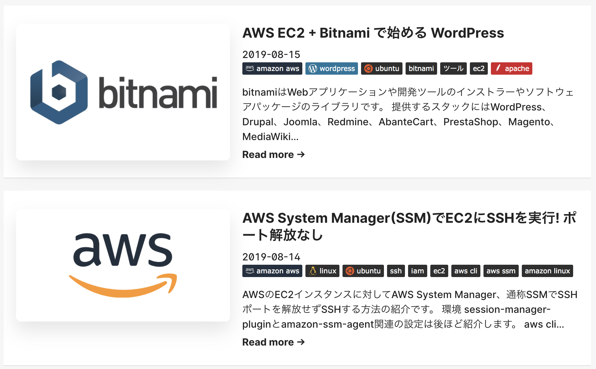
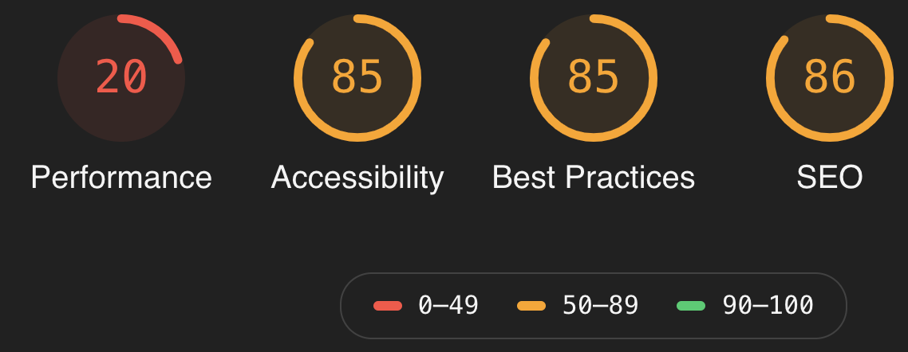

## 概要

当ブログ [tech-blog.s-yoshiki.com](tech-blog.s-yoshiki.com) を WordPressからGatsby製の静的サイトジェネレータに移行しました。

「Gatsby WordPress」と調べるとWordPressのWP REST APIを利用し、フロントにGatsbyを用いる HeadlessCMSのパターンが多く見られます。

しかし、ここでやったのは完全なWordPressの脱却です。

動的な要素であるサーバは一切利用せず、記事を全てmarkdown化することでテキストベースの管理。

そして記事と関連リソースの管理は全てGitに集中させる。ということを行いました。

泥臭い作業も多く、10人日近くかかってしまい、個人レベルでは大規模炎上案件となってしまいましたが、なんとか実現できました。

その際の具体的な移行方法や苦労した部分を書いていきます。

ちなみにWordPressを批判する目的で書いてはいません。


## これまでのWordPress運用

これまでは、WordPressでブログを4年間運用しており、その間、短期間ながらも管理方法をコロコロ変更してきました。

やってきたこと↓↓↓

**1年目**

Conoha VPS上にWordPressサーバを構築

**2年目**

VPSのように取り回しが効きやすいAmazon Lightsailにサーバを移行。


- [【WordPress】Amazon LightsailとCertbotでHTTPS化に挑戦してみた](https://tech-blog.s-yoshiki.com/entry/4)

- [Amazon Lightsailの半年間の利用料金が合計で3000円くらいで収まった。安い](https://tech-blog.s-yoshiki.com/entry/35)

- [AWS Lightsail + bitnami に自作アプリケーションを作って共存させる + ドメイン振り分け設定](https://tech-blog.s-yoshiki.com/entry/28)

**3年目**

AWSの勉強 + 固定費を変動費に変えて費用を抑えたいと思い AWS EC2上に引越し。攻撃などを受ける。

- [AWS EC2 + Bitnami で始める WordPress](https://tech-blog.s-yoshiki.com/entry/157)
- [Ubuntu18.04にApache MariaDB PHP7.2 をセットアップ](https://tech-blog.s-yoshiki.com/entry/155)
- [SAA試験対策 AWS BlackBeltを写経する](https://tech-blog.s-yoshiki.com/entry/165)

**4年目**

"動" から "静" へ。WordPressのプラグインで静的ファイルを生成。Amazon S3上でホストする。

WordPressはDocker上に移行し、ローカルホストして運用。

- [WordPress + WP2Static で静的サイトを生成する](https://tech-blog.s-yoshiki.com/entry/172)
- [WordPressをAmazon S3 + CloudFront構成で月額200円で運用](https://tech-blog.s-yoshiki.com/entry/171)


こんなことを行ってきました。

別のCMSへの乗り換えを検討した時期もありましたが、WordPressで一度書いてしまった記事を掘りこ起こすのは想像するだけで面倒な作業だったことと、SEOが強力なテーマを利用していて他のCMSに移りずらかったのでWordPressは捨てられませんでした。

## なぜWordPressを捨てるのか？ なぜGatsbyを利用するのか？

まずWordPressを捨てた理由はこちらです。

- 記事管理をWordPressの特殊タグで管理するのが苦痛
- 記事はテキストベース + Gitで管理したい
- 色んなプラグインを利用してきたためによる記事データの汚染が激しくなってきた
- サーバのメンテナンスが疲れた

そしてGatsbyを選んだ理由がこちらです。

- 静的化することでセキュリティの向上
- 動的な要素を減らしてサーバコスト削減
- とにかく速いらしい。Lighthouseで高いスコアを取れる

これがGatsbyへの移行の理由です。

WordPressでも静的ファイルを吐けますが(この時はWP Staticを利用していた)、とにかく時間がかかりました。

200記事で20分以上かかります。

## gatsbyについて

わかりやすい解説があったので、引用

> Gatsby（GatsbyJSとも）は、ReactJSで構築され、GraphQLを活用した静的サイトジェネレーターです。Gatsbyでは、誰でも機能豊富で魅力的なウェブサイトやアプリケーションを作成できます。Gatsbyは、GraphQLを使用して既存のウェブサイト、API呼び出しやフラットファイルなどのさまざまなソースからサイトのデータを取得し、指定した設定に基づいて静的サイトを構築します。

[GatsbyとWordPressを使用したウェブサイト構築の概要（高速で静的）](https://kinsta.com/jp/blog/gatsby-wordpress/) より


## WordPressから記事の救出

### 移行対象記事の抽出

[WordPressのDBから記事データを抽出する](https://tech-blog.s-yoshiki.com/entry/191) にも書きましたが、記事情報だけを取得するのであれば難しくはありません。サムネイルやタグ・カテゴリを抽出しようとすると多少は工夫が必要でした。

問題は次の作業でした。

### 記事の置換

抽出したデータをそのまま、markdownファイルに書き込んで表示させましたが、スタイルの崩壊が酷かったので記事データを修正していきました。

`h2`タグなどは`##`に変換。
`p` `div`タグなどは削除。
`pre` `code`タグは` ``` `に変換後、目視でソースを確認しシンタックスハイライトを付ける。
画像のパスを張り替え。URLの変更。特殊タグ削除など

(良く考えれば、ここでWP REST APIを利用すれば良かったんですね。。。)

## Gatsbyテーマの作成

Gatsbyのテーマを作成します。とは言っても1から作るのではなくgatsby-starter (お手軽に始めるための基本的なレイアウトが揃っているもの)を利用して作成していきました。

利用したのはこれ [panr/gatsby-starter-hello-friend - GitHub](https://github.com/panr/gatsby-starter-hello-friend/)

こんな感じになりました。



### Gatsbyに初めて触った時の所感

gatsby も react も初めてでしたが、コツを掴むとコンポーネントなどは簡単に実装できるようになりました。

graphqlはちょっと癖があり、filter文 (SQLでいうwhere句) などにてこずりました。

## 改めてWordPressとGatsbyを比較する

WordPressには4年間お世話になりましたが、豊富なテーマやプラグインそして情報量が圧倒的に多いので初心者や手軽に始めたい人を中心に今後も需要はあると思っています。

逆にGatsbyはテーマ (starter) が用意されてはいますが、最低限の部品のみを備えている場合が殆どであると思うので、ちょっとしたタグ一覧やサムネイル・年月ごとの記事一覧と言ったような機能を使うためには自作する必要があります。

こういう理由もあって、ある程度プログラムを理解できる人以外は手を出すべきではないと思います。嵌ります。

他にも静的サイトジェネレータの選択肢としてHugoやHexoなどもありましたが、今回は利用しないことにしました。

## まとめ

これからも長いこと記事を書いていくつもりですが、今回使ったGatsbyもおそらく3〜4年すれば技術的な負債になっていくと思います。しかし記事をマークダウン化したことで別のプラットフォームに乗り換えていくことが容易になったと思います。そういう意味で今回の技術選定は良かったかなと思います。

以上。

## ※おまけ

lighthouseでパフォーマンスを測定したら、こんなのになりました



前よりも低下しました。

これは多分、広告を貼り付けすぎなんでしょう。