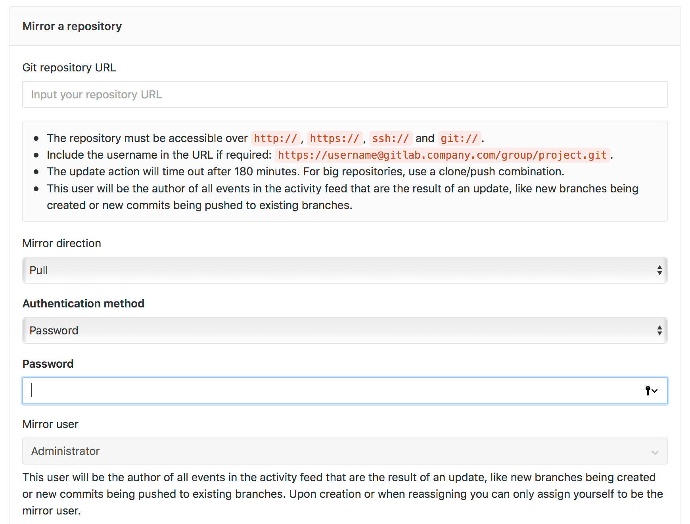
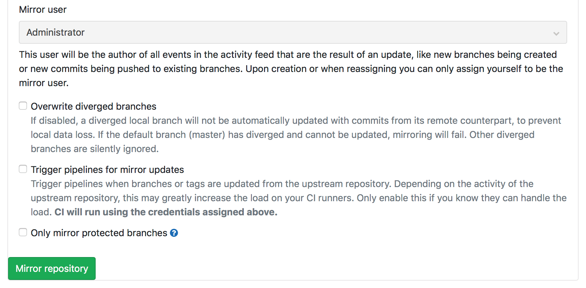
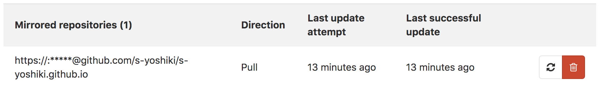
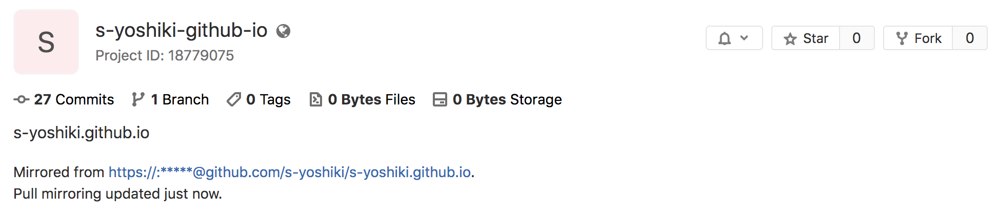

## 概要

GitLabのミラーリング機能によりGitHubなどの外部のリポジトリとのミラーリングを行うことができます。

これを使ってGitHubとミラーリングをしてみます。

## GitLabのミラーリングについて

コミット・ブランチ・タグなどがをミラーリングすることができます。

ミラーリングは自動で実行され、最大5分に1回、手動で更新することができます。

ミラーリングの種類は以下の2つがあります。

- push
- pull

**push**

GitLabのリポジトリを別の場所にミラーリングします。

**pull**

別の場所のリポジトリをGitLabにミラーリングします。

## GitHubのリポジトリをGitLabに反映する

 - `Settings` > `Repository` を選択し `Mirroring repositories` の項目を展開する
 - ミラーするリポジトリのURLを入力する
 - `Mirror Direction` で `pull` を選択する
 - `Authentication method` から必要に応じて認証方法を選択します
 - 必要に応じてチェックボックスの項目にチェックを入れます
   - 分岐したブランチを上書きする
   - ミラー更新のパイプラインをトリガーします
   - 保護されたブランチのみをミラーリングします
 - 緑の `Mirror repository` をクリックするとミラーリング開始されます

連携が成功すると次の画像のようなステータスの項目が出現します。
これで、ミラーリングの設定は完了です。

なお、リポジトリのトップ画面にも次のような項目 (Mirrored from ****) が出現します。

## その他

ミラーリポジトリが更新されると、すべての新しいブランチ、タグ、コミットがプロジェクトのアクティビティフィードに表示されます。

対象のリポジトリに対して、開発者権限以上のアクセス権限を持つユーザーは、強制で即時更新をすることもできます。
ただし、ミラー対象リポジトリがすでに更新済みの場合と前回の更新から5分以内の場合は即時更新できません。

セキュリティ上の理由から、GitLab 12.10以降では、元のリポジトリへのURLは、ミラーリングされたプロジェクトに対するMaintainerまたはOwner権限を持つユーザーにのみ表示されます。

## 参考

[https://docs.gitlab.com/ee/user/project/repository/repository_mirroring.html](https://docs.gitlab.com/ee/user/project/repository/repository_mirroring.html)

