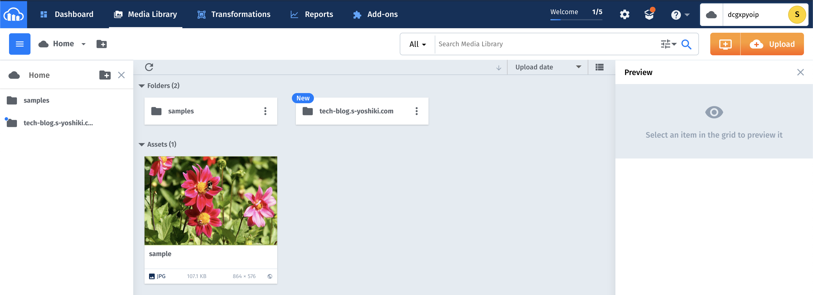
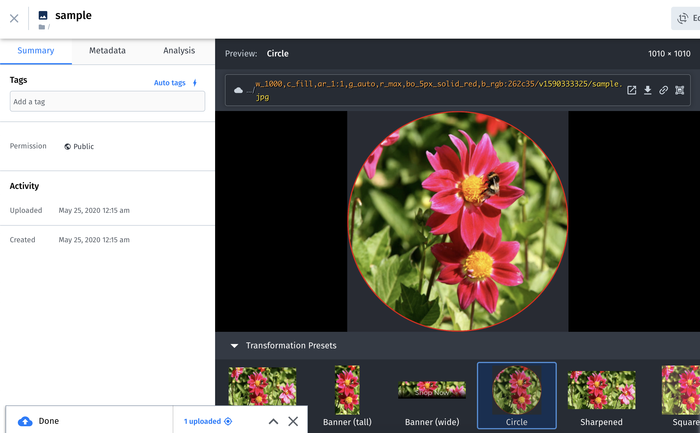

## 概要

画像の管理や配信、さらには加工といった事ができるsaas型のcloudサービスであるcloudinaryの紹介です。

### 目的

ブログ用の画像の管理に向いているか調べるために調査しました。

## cloudinary について

cloudinaryは、Webサイトやアプリの画像や動画をアップロード、保存、管理、操作、配信ができるサービス(もしくはこのサービスを提供する企業)です。

[Wikipedia(英)](https://en.wikipedia.org/wiki/Cloudinary) によると、「6,000社以上の550,000以上のWebおよびモバイルアプリケーション開発者によって使用されています」と書かれています。

## 他のサービスとの比較

cloudinaryの競合サービスとして[imgix](https://www.imgix.com/)や[imagekit](https://imagekit.io/)といったものがありますが
[Cloudinary vs imgix vs ImageKit vs Optimole: Which Is Best for Image Optimization?](https://themeisle.com/blog/cloudinary-vs-imgix-vs-imagekit-vs-optimole/) ではcloudinaryが最高評価となっています。

ちなみに、Qiitaではimgixの試験利用を行っているようです。
[Qiita Jobsにimgixを導入し、画像サイズを大幅に改善しました](https://qiita.com/hareku/items/cfa2ccef7ff9a8b9c5d2)

## 料金プラン

cloudinaryでは利用できるリソースの量を"クレジット"という単位で提供しています。

無料プランでは25クレジット利用できます。

1クレジットでは

- 1000回の転送
- 1GBのストレージ
- 1GBのネットワーク帯域もしくは500件の動画処理

となっています。

さらに課金コースだと、$99/月の場合225クレジット、$249/月の場合600クレジットとなります。

> * 1 credit = 1000 transformations or 1GB managed storage or 1GB net viewing bandwidth or 500 video processing seconds)

[Plans that scale with your growth](https://cloudinary.com/pricing)

## アカウントの登録

パスワードは大文字+小文字+記号が含まれている必要がありました。

サインアップが完了すると簡単なアンケートが出てくるので適当に入力します。

無事アカウント作成が完了するとサービスが利用できるようになります。

## 利用してみる

### ダッシュボード

ダッシュボードの画像です。

ディレクトリ作成やファイルの操作・移動といった操作はドラッグ&ドロップで直感的にできます。

### 画像の編集

画像の修正や簡単な加工はブラウザから操作できます。

編集した画像は、上に表示されているURLをコピペするだけで利用できます。

## APIベースでのアクセス

各プログラム言語から利用するためのAPIが提供されています。これを用いて画像サイズの最適化や遅延ロード用の画像の生成といった事ができます。

さらに詳い内容はここで紹介されています。

[Cloudinaryを使いこなすための10のポイント](https://dev.classmethod.jp/articles/top_10_tips_for_making_cloudinary_work_well_for_you/)

## 感想

非常に操作しやすいUIだったのが良かったです。

無課金で利用する場合画像ファイルに対し月25000万以上アクセスのあるブログやサイトで利用するのは厳しいのかなと思いました。
ただし、無課金でもクレジットの追加は可能みたいです。

## 参考

[Cloudinaryを使って画像の変換をやってみる](https://qiita.com/kanaxx/items/7d88948c9f8f43cdf760)

[Developers.IO 2019 Tokyo 登壇資料:「Cloudinaryの画像変換・配信で Webサイトを高速化」を発表してきました #cmdevio](https://dev.classmethod.jp/articles/developers-io-2019-tokyo-cloudinary/)

[Cloudinaryという画像変換サービスについて勉強してきた](https://note.com/chitapapa/n/n26053cf80609)