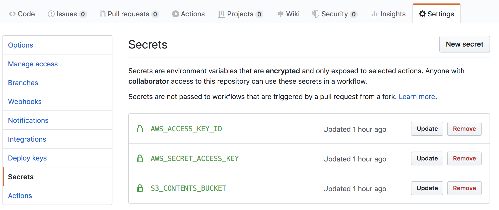
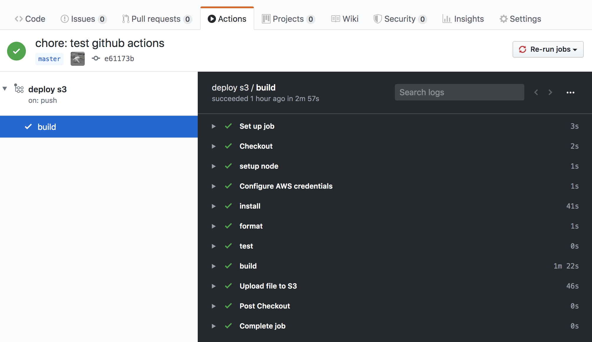

## 概要

Gatsbyで作った静的サイトを、GitHub Actions のワークフローで Amazon S3に自動ビルド+デプロイする方法の紹介です。

このサイトも、Gatsby + Amazon S3 + CloudFront の構成なのですが、ビルド & デプロイを手動で行うのは中々退屈なので自動化しようと思いました。

またGatsbyで作ったサイトを「Netlifyにデプロイする」や「GitHub Pagesにアップロードする」みたいな記事はあったもののS3へのデプロイは意外となかったのでこの記事を書きました。


## GitHub Actions について

GitHub Actionsは GitHubが提供しているCI/CDツールです。

パブリックのリポジトリなら無料で利用することができ、
プライベートリポジトリでもFreeプランであれば月に2000分利用する事ができます。

[GitHub Actions](https://github.co.jp/features/actions)

## あらかじめ準備しておくもの

ここで紹介する方法では、次のリソースを利用します。

 - S3バケット
 - AWS IAM ユーザ
   - アクセスキーID
   - シークレットアクセスキー
 - GitHubリポジトリ (Gatsbyのコンテンツ)

## AWS IAM ユーザを環境変数にセットする

S3にデプロイする際に、アクセスキーID & シークレットアクセスキーを利用しますが、
ソースへのハードコーディングを避けるためにGitHub Secretsを利用します。



ここでは、以下の値をセットします。

|NAME|VALUE|
|-|-|
|`AWS_ACCESS_KEY_ID`| IAMユーザのアクセスキーID|
|`AWS_SECRET_ACCESS_KEY`| IAMユーザのシークレットアクセスキー|
|`S3_CONTENTS_BUCKET`| S3のバケット名|

## workflowの記述

.github/workflows/ 以下にワークフローの定義ファイルを配置します。
ファイルはyml形式で記述します。

**.github/workflows/s3-deploy.yml**

```yml
name: deploy s3

on:
  push:
    branches:
      - master

jobs:
  build:
    runs-on: ubuntu-latest
    timeout-minutes: 5

    steps:
      - name: Checkout
        uses: actions/checkout@v2

      - name: setup node
        uses: actions/setup-node@v1
        with:
          node-version: '12.x'

      - name: Configure AWS credentials
        uses: aws-actions/configure-aws-credentials@v1
        with:
          aws-access-key-id: ${{ secrets.AWS_ACCESS_KEY_ID }}
          aws-secret-access-key: ${{ secrets.AWS_SECRET_ACCESS_KEY }}
          aws-region: ap-northeast-1

      - name: install
        run: npm ci

      - name: format
        run: npm run format

      - name: test
        run: npm run test

      - name: build
        run: npm run build

      - name: Upload file to S3
        env: 
          S3_CONTENTS_BUCKET: ${{ secrets.S3_CONTENTS_BUCKET }}
        run: |
          aws s3 sync ./public s3://$S3_CONTENTS_BUCKET/ --quiet
```

この設定はmasterブランチにpushされたらnpm環境を用意して、Gatsbyコンテンツをビルドしたらs3にデプロイするという流れになっています。

ホストランナーには `ubunu-latest`を利用しています。(windowsやmacなんかも利用する事ができます)

コード内にある、`secrets.AWS_ACCESS_KEY_ID` や `secrets.AWS_SECRET_ACCESS_KEY`に上で設定した環境変数が埋め込まれます。


## ビルド

ビルドが完了後、任意の完了したワークフローをクリックするとするとこのような画面が表示されます。

成功した部分に緑のチェックマークが表示されます。



▶︎ マークをクリックしてイベントの詳細を閲覧する事ができます。

## バッジを利用する

ビルドがうまくいったかを確認しやすくするためにバッジを利用します。

バッジは次の形式のURLで利用する事ができます。

```
https://github.com/<OWNER>/<REPOSITORY>/workflows/<WORKFLOW_NAME>/badge.svg
```

## 終わりに

ここでは、Gatsbyで作った静的サイトを、GitHub Actions のワークフローで Amazon S3に自動ビルド+デプロイする方法を紹介しました。

これで本ブログのビルド&デプロイが自動でできるようになったので、より快適に記事を書け、投稿スピードも上げていくことができるでしょう。

また、個人的にはGitLabを利用する機会が多いので近々GitLab-CIによるデプロイ方法を書けたらなあと思います。

## 参考にしたところ

[Gatsby のサイトを GitHub Actions で GitHub Pages にデプロイ](https://qiita.com/peaceiris/items/2f6d83802f2aefa66f9d)

[GitHub ActionsワークフローでAmazon S3のオブジェクトにアクセスする](https://dev.classmethod.jp/articles/s3-file-up-down-from-github-actions/)

[GitHub Actionsを使ってnuxt.jsで作成した静的WebページをS3に自動デプロイする](https://qiita.com/1pp0/items/23c679eec04f19815e81)