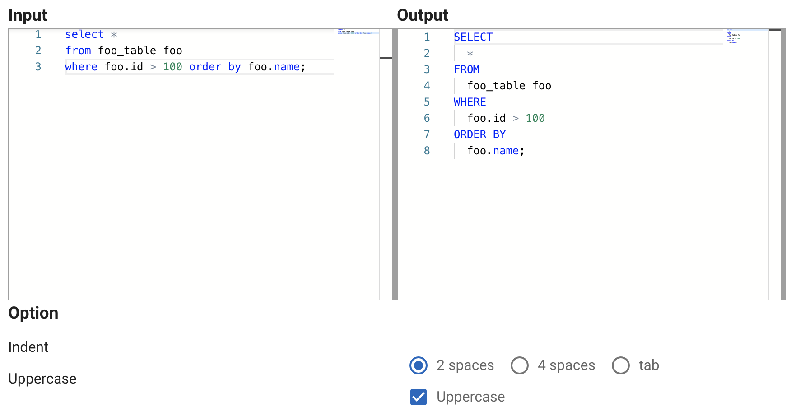

## 概要

SQL整形ツールを作成しました。

URLはこちらです。

[SQL 整形ツール - うぇぶでゔツール](https://webdevtool.s-yoshiki.com/sql/pretty)



## 特徴

 - フロントのみで完結するサービスなのでサーバにソースを送ったりすることはありません。
 - シンタックスハイライト機能
 - アッパーケース対応
 - インデント変更可能
 - リアルタイム変換
 - その他、各種機能追加の検討中

## 使い方

例えば次のような入力値が

```sql
select * 
from foo_table foo 
where foo.id > 100 order by foo.name;
```

このように変換されます。

```sql
SELECT
  *
FROM
  foo_table foo
WHERE
  foo.id > 100
ORDER BY
  foo.name;
```

インデントは2スペース、4スペース、タブを選択することができます。


## FW/ライブラリ等

### nuxt

ページの作成にvue nuxtを利用しています。

### sql-formatter-plus

SQLの整形に `sql-formatter-plus` を使っています。

[SQL Formatter Plus](https://github.com/kufii/sql-formatter-plus)

### Monaco Editor

エディタ部分の実装はMonacoEditorを利用しています。

[Monaco Editor](https://microsoft.github.io/monaco-editor/)

## おまけ

### ソース

サンプルコードです。

```html
<template>
  <div>
    <v-row no-gutters>
      <v-col sm="6">
        <h3>Input</h3>
        <div class="monacoCover">
          <MonacoEditor
            ref="srcEditor"
            v-model="srcCode"
            :language="language"
            :diffEditor="false"
            :theme="dark ? 'vs-dark' : 'default'"
            :style="{ width: clientWidth, height: clientHeight }"
            :readOnly="true"
            :options="{
              scrollBeyondLastLine: true,
              wordWrap: 'on',
              fontSize: fontSize,
              enableSplitViewResizing: false,
              ignoreTrimWhitespace: false,
            }"
            @editorWillMount="onSrcEditorWillMount"
          />
        </div>
      </v-col>
      <v-col sm="6">
        <h3>Output</h3>
        <div class="monacoCover">
          <MonacoEditor
            ref="dstEditor"
            v-model="dstCode"
            :language="language"
            :theme="dark ? 'vs-dark' : 'default'"
            :style="{ width: clientWidth, height: clientHeight }"
            :readOnly="true"
            :options="{
              scrollBeyondLastLine: true,
              wordWrap: 'on',
              fontSize: fontSize,
              enableSplitViewResizing: false,
              ignoreTrimWhitespace: false,
            }"
            @editorWillMount="onDstEditorWillMount"
          />
        </div>
      </v-col>
    </v-row>
    <h3>Option</h3>
    <v-row style="height: 35px">
      <v-col>Indent</v-col>
      <v-col>
        <v-radio-group v-model="formatOpt.indent" row>
          <v-radio label="2 spaces" value="0"></v-radio>
          <v-radio label="4 spaces" value="1"></v-radio>
          <v-radio label="tab" value="2"></v-radio>
        </v-radio-group>
      </v-col>
    </v-row>
    <v-row style="height: 35px">
      <v-col>Uppercase</v-col>
      <v-col>
        <v-checkbox
          v-model="formatOpt.uppercase"
          label="Uppercase"
          hide-details
        ></v-checkbox>
      </v-col>
    </v-row>
  </div>
</template>

<script>
import MonacoEditor from "vue-monaco";
import SqlFormatter from "sql-formatter-plus";

export default {
  components: { MonacoEditor },
  data: () => ({
    srcCode:
      "select * from foo_table foo where foo.id > 100 order by foo.name;",
    srcMonaco: null,
    dstMonaco: null,
    language: "sql",
    dark: false,
    fontSize: 12,
    clientWidth: "99%",
    clientHeight: "300px",
    formatOpt: {
      indent: "0",
      uppercase: true,
    },
  }),
  methods: {
    onSrcEditorWillMount(monaco) {
      this.srcMonaco = monaco;
    },
    onDstEditorWillMount(monaco) {
      this.dstMonaco = monaco;
    },
    resize(el) {
      this.$refs.srcEditor.getEditor().layout();
      this.$refs.dstEditor.getEditor().layout();
    },
  },
  mounted() {
    window.addEventListener("resize", this.resize);
  },
  destroyed() {
    window.removeEventListener("resize", this.resize);
  },
  computed: {
    dstCode: function () {
      const indentType = ["  ", "    ", "\t"];
      try {
        return SqlFormatter.format(this.srcCode, {
          language: "sql",
          indent: indentType[Number(this.formatOpt.indent)],
          uppercase: this.formatOpt.uppercase,
          linesBetweenQueries: 2,
        });
      } catch (e) {
        return "";
      }
    },
  },
};
</script>

<style scoped>
.monacoCover {
  background-color: #9f9f9f;
  padding: 1px;
}
</style>
```

