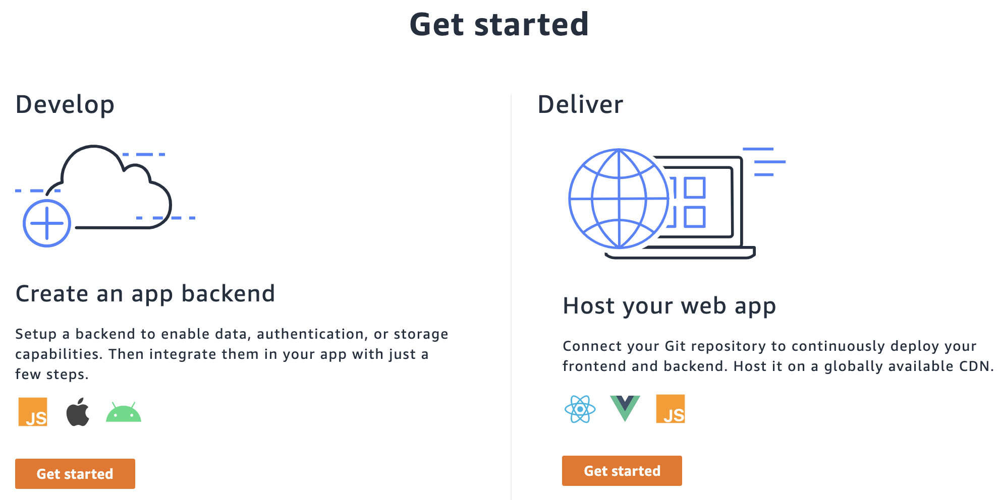
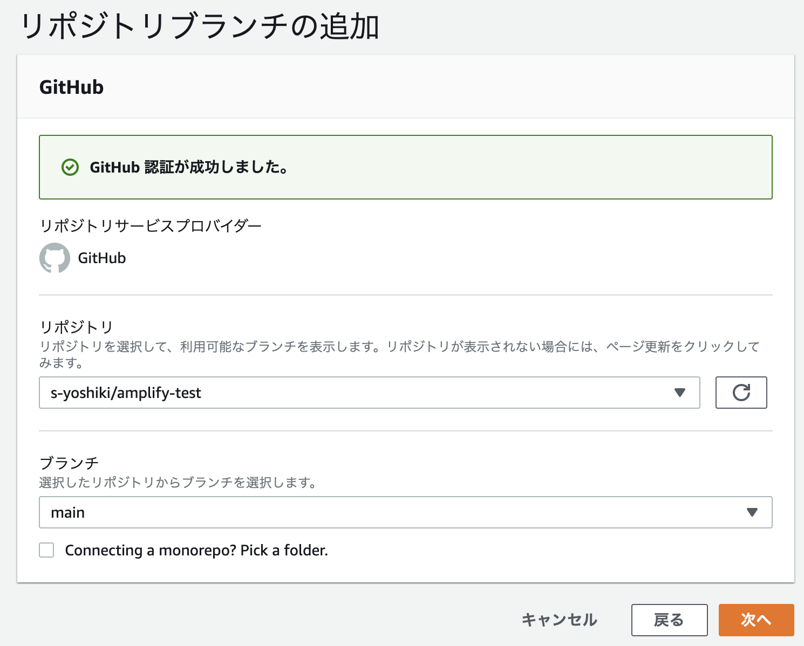
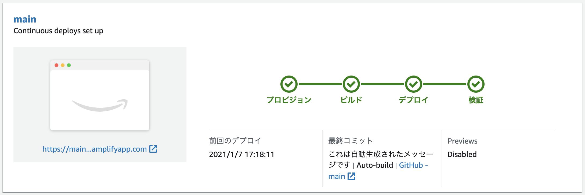

## 概要

この記事では、React / Next.js アプリケーションを作成し、AWS Amplify のウェブホスティングサービスを使ってそれをデプロイする方法を説明します。

※ ここで説明するのはNext.js の SSG (静的ファイル生成) による方法です。SSRを利用した方法は別途記事を書きます。

## はじめに

この記事で行っていることを説明します。

まず React / Next.js アプリケーションを作成し、それを GitHub リポジトリにプッシュします。
その後、リポジトリを AWS Amplify のウェブホスティングに接続し、amplifyapp.com ドメイン上でホストされる、CDN にデプロイします。
次に、React アプリに変更を加えることで CI の機能に触れ、main ブランチに新しい変更をプッシュして自動的にデプロイが開始するようにします。

やること

 - React アプリケーションを作成
 - Git リポジトリに追加
 - AWS Amplify でデプロイ
 - 変更を加えて再デプロイ

## 操作

### Next.js (React) アプリの作成、Gitへのプッシュ

次のコマンドで Next.js アプリを作成します。

```shell
npx create-next-app amplify-test --use-npm --example "https://github.com/vercel/next-learn-starter/tree/master/learn-starter"
cd amplify-test
npm run dev
```

[http://localhost:3000/](http://localhost:3000/)にアクセスすると「Welcome to Next.js!」を表示されると思います。

次に`package.json`を変更します。script の buildの箇所を修正します。
この設定は静的ファイルをoutディレクトリに吐く設定です。

```
  "scripts": {
    "dev": "next dev",
    "build": "next build && next export",
    "start": "next start"
  },
```

ここまで作成できたら GitHub にリポジトリを作成しコミットします。

```shell
git init
git remote add origin https://github.com/${user_name}/amplify-test.git
git add .
git commit -m "initial commit"
git push origin main
```

### AWS Amplifyでプロジェクト作成

[マネジメントコンソール](https://console.aws.amazon.com/)から `AWS Amplify` を選択します。



「Host your web app」の「Get Started」を選択します。

`GitHub` を選択し「continue」します。そうするとGitHubの認可処理に入るので認証情報を入力します。



次にリポジトリのブランチを選択し「次へ」を選択します。

その次にビルド情報をyml形式で入力します。
気をつけて欲しいのは `frontend->artifacts->baseDirectory`のところです。
現時点での Next.js の設定は out ディレクトリにコンテンツを吐くような仕組みにしているため、このディレクトリを参照する用に設定を変えます。

```yml
version: 1
frontend:
  phases:
    preBuild:
      commands:
        - npm ci
    build:
      commands:
        - npm run build
  artifacts:
    baseDirectory: out # ← 書き換える
    files:
      - '**/*'
  cache:
    paths:
      - node_modules/**/*
```

最後に確認画面が出てくるので内容を確認したら次に進みます。

そうするとすぐにビルドが始まります。検証まで完了するとアクセスできるようになります。



再び変更を commit & push するとビルドが始まるのが確認できると思います。


## 参考にしたサイト

[AWS で React アプリケーションを構築する](https://aws.amazon.com/jp/getting-started/hands-on/build-react-app-amplify-graphql/module-one/)

[Next.jsの静的サイト生成(SSG)について確認](https://www.wakuwakubank.com/posts/771-react-nextjs-ssg/)