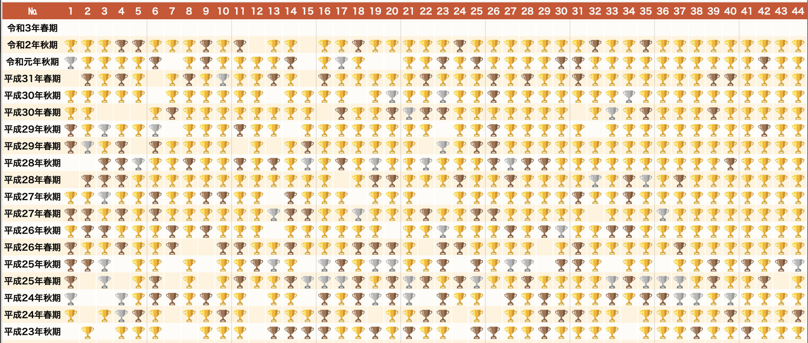
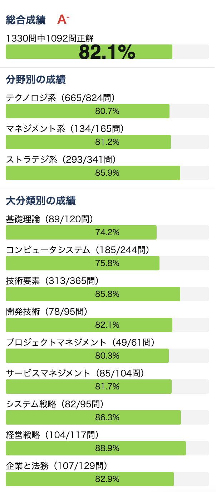

## 概要

令和3年春期の応用情報技術者試験に合格しました。

何かの・誰かのためになると思い、受験結果や選択した問題学習方法・対策等について書き記しました。

## 受験時のステータス

受験時のステータスは以下です。

- 社会人4年目
- 大学の専攻は理系、いわゆる"情報系"
- SIerでプログラマー(4年)
- 受験時に取得済み資格
  - AWSソリューションアーキテクトアソシエイト
  - アルゴリズム実技検定

## 受験結果

受験結果は合格でした。
午前中は余裕の結果でした。午後はギリギリでしたがなんとか合格ラインを上回りました。

午後問題では

- セキュリティ(必須)
- プログラミング
- システムアーキテクチャ
- ネットワーク
- システム監査

を選択しました。

セキュリティについてはDNSのセキュリティ対策についての出題でした。業務で利用する要素が多かったため躓くことなく比較的得点を取れました。

プログラミングに関してはk-means法の実装について出題されました。たまたま趣味でk-meansを実装したことがありアルゴリズムに覚えがあったため得点に結びつけることができました。

システムアーキテクチャについては"IoT技術を用いた駐車場管理システム"というテーマで出題されました。
本来はDBを選択しシステムアーキテクチャの問題を選択する予定は無かったのですが(詳細後述)、DBの問題が解けず難しかったため急遽システムアーキテクチャに切り替えました。

ネットワークについては対策通り安定して得点できました。

## 対策

### スケジュール

試験を受けようと思った段階で試験まで100日(=3ヶ月)だったこともあり以下のようなスケジュールを立てました。

- 2ヶ月午前問題の対策
- 1ヶ月午後問題の対策
- 平日は通勤の1時間午前の対策を行う
- 土日は最低4時間(1日2時間)程度行う

※ ↑ 大雑把に計算すると約128時間となりますが実績はこの数字の 3 / 4くらいだと思います。

ポイントとしては継続できることを目標に無理ない時間・量に設定しました。

午後問題の比重を下げているのはセキュリティやネットワーク・DBは業務で扱っている知識で十分対応できると思ったことと、より広い知識が要求される午前に重点を置くためでした。

### 午前問題

午前問題は「応用情報技術者試験ドットコム」を中心に対策を行いました。
具体的には直近18回で出題された問題を2回以上正解するまで解き続けました。
おおよそ各期の問題を3周くらい解きました。

午前問題の中でも暗記で対応できるものを中心に対策しました。

これは計算自体が得意でなく、時間もかかり、個人的にはコスパが悪いので1度やり方を覚えたらスキップするようにしました。

また主に通勤時間中に対策していたこともあり、対策スタイルが計算問題と相性が悪いというのもありました。

「応用情報技術者試験ドットコム」は計算問題を除外出来るので便利でした。

実績については以下のようになりました。

また最終的な正答率は試験前までには80%を超えるようなりました。この時点で午前問題は十分自信がついたため午後問題に切り替えました。本番では過去問と似たような問題がいくつか出題されたため落ち着いて解くことができました。

振り返りとして、過去問演習はとても有効だったなと思いました。

### 午後問題

午後問題は以下の分野から出題され、情報セキュリティ(必須)1問と4問選択して解答します。

- 情報セキュリティ (必須)
- ストラテジ系
  - 経営戦略 / 情報戦略 / 戦略立案・コンサルティング技法
- テクノロジ系
  - システムアーキテクチャ
  - ネットワーク
  - データベース
  - 組込みシステム開発
  - 情報システム開発
  - プログラミング (アルゴリズム)
- マネジメント系
  - プロジェクトマネジメント
  - サービスマネジメント
  - システム監査

この中では

本番では情報セキュリティ + ネットワーク・データベース・プログラミング・システム監査 を選択する予定ものとし、

特に情報セキュリティ・ネットワークの対策を進めました。データベース・プログラミング・システム監査はぶっつけ本番のつもりでした。

対策は過去問をざっと読んで傾向をなんとなく把握していき、全く分からないものは調べたりして進めました。

午後問題の対策は1ヶ月ほど取る予定でしたが、繁忙などが重なり実質2週間分しかできず試験を受けました。

振り返ると午後の対策はやはり疎かでした。

実際の試験ではDBが難しく問題を解いている途中で捨てて、システムアーキテクチャに切り替えました。

システムアーキテクチャを解いてもそこまで自信はなく、システムアーキテクチャかDBを選択するかでとても迷いました。

そのようなこともあり選択予定の分野に加えて1~2分野保険をかけて勉強しておくべきだと感じました。

情報セキュリティではネットワーク系の知識があると解きやすくなることもあり、ネットワークの対策が一石二鳥になったと思いました。

また午前と同様に過去問演習は有効だと思いました。

### 参考書等

[応用情報技術者試験ドットコム](https://www.ap-siken.com/) を中心に進めました。

<iframe style="width:120px;height:240px;" marginwidth="0" marginheight="0" scrolling="no" frameborder="0" src="//rcm-fe.amazon-adsystem.com/e/cm?lt1=_blank&bc1=000000&IS2=1&bg1=FFFFFF&fc1=000000&lc1=0000FF&t=yoshiki037-22&language=ja_JP&o=9&p=8&l=as4&m=amazon&f=ifr&ref=as_ss_li_til&asins=4297117835&linkId=1fc26c4260bad3332526c79f3b69d1fb"></iframe>

[キタミ式イラストIT塾](https://amzn.to/2UED9Ac) という本も書いました。

数ある参考書の中で選択したのはイラストが多いのがわかりやすいと感じたからです。

実際に本を開いた回数は多くはなかったですが、「お金を払って参考書を買った!」というソコソコの出費がモチベーション維持に繋がったと思います。

このような本はITエンジニアとして必要な知識が幅広く体系的に記載されているので資格対策以外でも1冊あると重宝すると思います。
