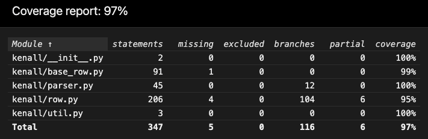
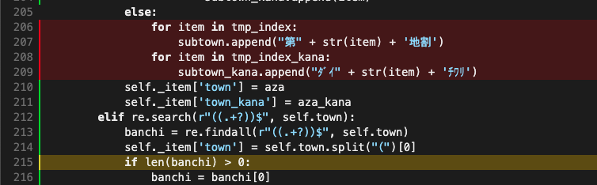
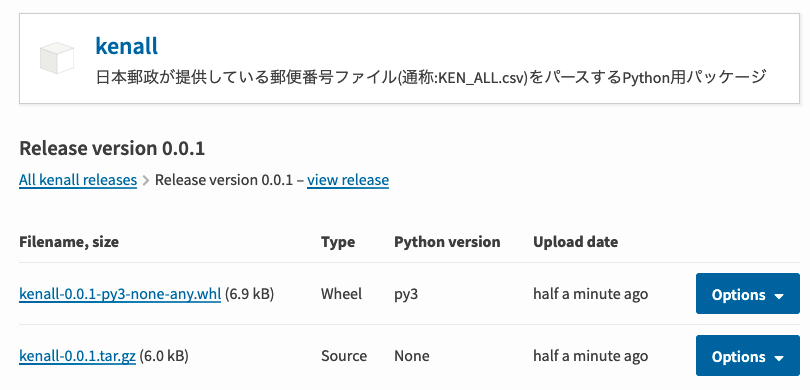
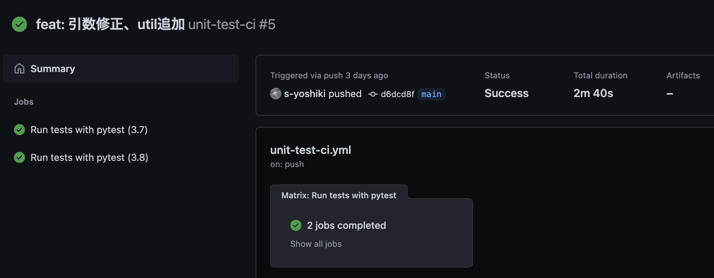
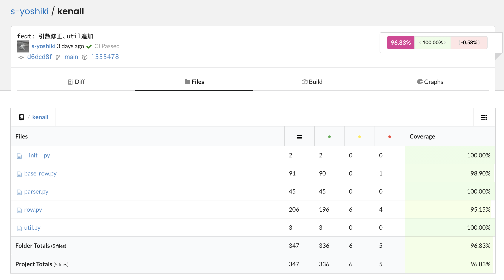

## 概要

Python の Poetryでプロジェクトを初期化してパッケージを開発し、
GitHub に push してpytest(ユニットテストフレームワーク)でテストを実施・カバレッジを取得後 codecov に反映。
ビルドしたパッケージを PyPI に登録し配布するまでの一連の流れを行った際の記録です。

この作業の副産物として [kenall](https://github.com/s-yoshiki/kenall) という郵便番号csvをパースするPythonパッケージを作成しました。

ここでは`kenall`というパッケージ名で作成・公開するものとします。参考にする場合は適宜置き換えてください。

**検証した環境**

この作業はPython3.9で行いました。

## Poetry でパッケージ開発

[Poetry](https://python-poetry.org/docs/)はPythonの依存関係管理ツールです。

インストールは以下のコマンドから行います。

```shell
$ curl -sSL https://raw.githubusercontent.com/python-poetry/poetry/master/get-poetry.py | python -
$ poetry --version
Poetry version 1.1.6
```

poetry のセットアップが完了したらプロジェクトを作成していきます。

```shell
$ poetry new kenall
Created package kenall in kenall
$ tree -N kenall 
kenall
├── README.rst
├── kenall
│   └── __init__.py
├── pyproject.toml
└── tests
    ├── __init__.py
    └── test_kenall.py
```

`kenall/kenall` というディレクトリが作成され、ここにコードを作成していきます。
ただし、`kenall/src` としたい場合は `poetry new --src kenall` というオプションで srcレイアウトにできますが、
[問題を起こす原因](https://qiita.com/sasaki77/items/97c90ae272373d78b422#%E3%83%86%E3%82%B9%E3%83%88%E3%83%AC%E3%82%A4%E3%82%A2%E3%82%A6%E3%83%88%E3%82%A4%E3%83%B3%E3%83%9D%E3%83%BC%E3%83%88%E3%83%AB%E3%83%BC%E3%83%AB%E3%81%AE%E9%81%B8%E6%8A%9E) となり得るので推奨されません。

`kenall/pyproject.toml` はパッケージ情報について定義するファイルです。

`kenall/tests` にはテストコードを配置します。このテストコードは pytest(テストフレームワーク)を利用して開発していきます。

## pytest でユニットテストを実施しカバレッジを算出する

pytestはPythonのテストフレームワークです。

poetry を利用している場合、テストコードの実行は次のコマンドで実施します。

```
$ poetry run pytest \
  --cov=kenall \
  --cov-branch \
  -v ./tests/* \
  --cov-report=html
```

- `--cov` : テスト対象のディレクトリを指定します
- `--cov-branch` : 条件分岐(c1) のカバレッジを取得します
- `-v` : テストコードを指定します
- `--cov-report` : レポートを出力します。htmlやxmlが選択できます。

htmlのレポートを選択した場合以下のようなレポートが作成されます。



htmlレポートの概要ページです。



htmlレポートの詳細ページです。実行されなかったコードが赤や黄色で着色されています。

## パッケージをビルドし PyPI で公開する

PyPIで公開するためにアカウントを作成します。
PyPIは検証と本番の2つの環境が用意されておりますが、検証に公開する場合と本番に公開する場合でコマンドのオプションが変わります。

- 検証: [https://test.pypi.org/](https://test.pypi.org/)
- 本番: [https://pypi.org/](https://pypi.org/)

また、どちらの環境に公開する場合でも[pyproject.toml](https://python-poetry.org/docs/pyproject/)(パッケージのビルドに必要なデータを定義するファイル)も編集しておきます。

```js
[tool.poetry]
name = "kenall"
version = "0.0.1"
description = "日本郵政が提供している郵便番号ファイル(通称:KEN_ALL.csv)をパースするPython用パッケージ"
authors = ["s-yoshiki <mail@foo.com>"]
homepage = "https://github.com/s-yoshiki"
repository = "https://github.com/s-yoshiki/kenall"
documentation = "https://github.com/s-yoshiki/kenall"
license = "MIT"

[tool.poetry.dependencies]
python = "^3.6"
mojimoji = "^0.0.11"

[tool.poetry.dev-dependencies]
pytest = "^5.2"
pytest-mock = "^3.6.0"
pytest-cov = "^2.11.1"

[build-system]
requires = ["poetry-core>=1.0.0"]
build-backend = "poetry.core.masonry.api"
```

### 検証環境にデプロイする

PyPI検証環境に反映する場合は次の手順で実施します。

まずはPyPI検証環境のusername・passwordをローカルに登録します。

```
$ poetry config http-basic.testpypi ${username} ${password}
```

設定内容は次のコマンドで確認することができます。

```
$ poetry config --list
cache-dir = "/Users/kenall/Library/Caches/pypoetry"
experimental.new-installer = true
installer.parallel = true
repositories.testpypi.url = "https://test.pypi.org/legacy/"
virtualenvs.create = true
virtualenvs.in-project = null
virtualenvs.path = "{cache-dir}/virtualenvs"
```

次にプロジェクトをビルドします。ビルド後`dist`ディレクトリにビルドしたものが出力されます。

```shell
$ poetry build              
Building kenall (0.0.1)
  - Building sdist
  - Built kenall-0.0.1.tar.gz
  - Building wheel
  - Built kenall-0.0.1-py3-none-any.whl
$ ls ./dist      
kenall-0.0.1-py3-none-any.whl   kenall-0.0.1.tar.gz
```

publishコマンドでPyPIに反映します。検証のみ`-r`オプションを指定します。

```shell
$ poetry publish -r testpypi

Publishing kenall (0.0.1) to PyPI
 - Uploading kenall-0.0.1-py3-none-any.whl 100%
 - Uploading kenall-0.0.1.tar.gz 100%
```

検証PyPIで公開したパッケージをpipでインストールしてみます。検証を指定する場合`--index-url`オプションを利用します。

```
$ pip install kenall --index-url https://test.pypi.org/simple
```

### 本番環境にデプロイする

PyPI本番環境に反映する場合は次の手順で実施します。

PyPI本番環境のusername・passwordをローカルに登録します。検証とオプションが異なるので注意します。

```
$ poetry config http-basic.pypi ${username} ${password}
```

次にプロジェクトをビルドします。ビルド後`dist`ディレクトリにビルドしたものが出力されます。

```shell
$ poetry build              
Building kenall (0.0.1)
  - Building sdist
  - Built kenall-0.0.1.tar.gz
  - Building wheel
  - Built kenall-0.0.1-py3-none-any.whl
$ ls ./dist      
kenall-0.0.1-py3-none-any.whl   kenall-0.0.1.tar.gz
```

publishコマンドでPyPIに反映します。

```shell
$ poetry publish

Publishing kenall (0.0.1) to PyPI
 - Uploading kenall-0.0.1-py3-none-any.whl 100%
 - Uploading kenall-0.0.1.tar.gz 100%
```

アップロードが成功すると、ビルドしたファイルがこのように表示されます。



[https://pypi.org/manage/project/kenall/release/0.0.1/](https://pypi.org/manage/project/kenall/release/0.0.1/)

pipでインストールすることが可能となります。

```shell
$ pip install kenall
```

## GitHub Actions で CI を回す

pytestを自動で実行し、カバレッジを[codecov](https://about.codecov.io/)に反映するように設定を行います。

### codecovの設定

codecov のアカウントを作成します。githubの任意のリポジトリを設定したらアップロードトークンを取得します。

GitHubのリポジトリの Settings → Secrets → New Repository Secrets から coddecov のアップロードトークンを保存します。

ここでは キーを `CODECOV_TOKEN` として保存します。

### GitHub Actionsの設定

`.github/workflows/unit-test.yml` を作成し、以下のコードを記載します。

```yml
name: unit-test # ymlファイルと同じ名前にする

# トリガーとなるブランチの定義
on:
  push:
    branches:
      - main
  pull_request:
    branches:
      - main

## job の定義
jobs:
  pytest:
    name: Run tests with pytest
    runs-on: ubuntu-latest
    strategy:
      matrix:
        python-version: [3.5, 3.8, 3.9]
    steps:
      # リポジトリのチェックアウト
      - name: Checkout
        uses: actions/checkout@v2
      # ランタイムセットアップ
      # バージョンは `strategy.matrix` に並べたものを指定する
      # See: https://github.com/actions/setup-python
      - name: Set up Python ${{ matrix.python-version }}
        uses: actions/setup-python@v1
        with:
          python-version: ${{ matrix.python-version }}
      # Poetry をインストールする
      - name: Install Poetry
        run: |
          curl -sSL https://raw.githubusercontent.com/python-poetry/poetry/master/get-poetry.py | python
      # Poetry へのパスを通す
      - name: Add path for Poetry
        run: echo "$HOME/.poetry/bin" >> $GITHUB_PATH
      # インストールした Poetry を使って必要な Python パッケージをインストールする
      - name: Install Dependencies
        run: poetry install --no-interaction
      # pytest を実行しカバレッジを取得する
      - name: Run Tests
        run: poetry run pytest --cov=kenall --cov-branch -v ./tests/test_* --cov-report=xml 
      # codecovへカバレッジ結果をupload
      - name: Upload coverage to Codecov
        if: ${{ matrix.python-version==3.9 }}
        uses: codecov/codecov-action@v1
        with:
          token: ${{ secrets.CODECOV_TOKEN }} # ← CODECOVのアップロードトークン
          file: ./coverage.xml
          name: codecov-umbrella
          fail_ci_if_error: true
```

ユニットテストが成功するとこのような表示となります。



また CIの結果をバッジとして表示することができます。


```
https://github.com/s-yoshiki/kenall/workflows/unit-test-ci/badge.svg
```

一方、カバレッジのアップロードが成功していればcodecovのダッシュボードで結果を閲覧することができます。



codecovのカバレッジ結果もバッジとして表示することができます。


## Link

[Poetry: Python の依存関係管理とパッケージングを支援するツール | org-技術](https://org-technology.com/posts/python-poetry.html)

[Poetryを使ったPythonパッケージ開発からPyPI公開まで - PYTHONIC BOOM BOOM HEAD](https://kk6.hateblo.jp/entry/2018/12/20/124151)

[pyproject.toml とは何か](https://tech.515hikaru.net/post/2019-11-23-pyproject/)

[Python のビルドとテスト](https://docs.github.com/ja/actions/guides/building-and-testing-python)
