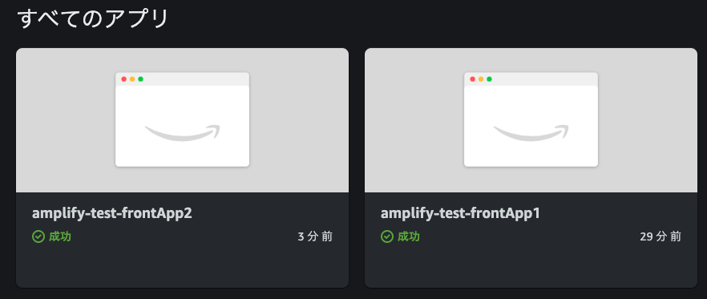

## 概要

amplifyのプロジェクトでmonorepo化を実現しました。

(単一リポジトリで複数のフロントエンドを構築する)

### 環境

この作業は以下の環境で実施しています。

- macOS 12.1
- node v17.5.0
- typescript 4.3.5
- amplify-cli 7.6.21

## monorepoとは

複数のプロジェクトを1つのリポジトリで管理する開発方式です。

最近目にする回数が多くなったので新しい概念と思いきや、
20年以上前からある考えであり、"shared codebase" と呼ばれています。

> In version control systems, a monorepo is a software development strategy where code for many projects is stored in the same repository.
>
> https://en.wikipedia.org/wiki/Monorepo

Google Facebook でもこの方式を採用しています。

## なぜmonorepoにしたのか？

なぜmonorepo化にしたのか、、、それは

1. 複数のフロントエンドとバックエンドをtypescriptで構築しinterfaceを共有する
2. 1つのリポジトリに統一しプロジェクト全体の見通しを良くする
3. 複数の環境へのステージングを1つのパイプラインに乗せたい

といった理由があったからです。

## Amplify プロジェクト初期化

### 流れ

1. リポジトリに2つのプロジェクトの構成を構築する
2. Amplify上でフロントエンドアプリケーションを1つ作成しリポジトリを連携
3. Amplify上でフロントエンドアプリケーションの2つめを作成しリポジトリを連携

### リポジトリの作成

リポジトリの構成を次の様に構築します。

※
フロントエンドにNextJSを利用しました。

https://docs.amplify.aws/guides/hosting/nextjs/q/platform/js/

```
.
├── README.md
├── amplify
├── amplify.yml
├── frontApp1
│   ├── README.md
│   ├── next-env.d.ts
│   ├── next.config.js
│   ├── node_modules
│   ├── package-lock.json
│   ├── package.json
│   ├── pages
│   ├── public
│   ├── styles
│   └── tsconfig.json
└── frontApp2
    ├── README.md
    ├── next-env.d.ts
    ├── next.config.js
    ├── node_modules
    ├── package-lock.json
    ├── package.json
    ├── pages
    ├── public
    ├── styles
    └── tsconfig.json
```

また`amplify.yml`を次の様に記載します。

```yaml
version: 1
applications:
  - appRoot: frontApp1
    frontend:
      phases:
        preBuild:
          commands:
            - npm install
        build:
          commands:
            - npm run build
      artifacts:
        baseDirectory: .next
        files:
          - '**/*'
      cache:
        paths:
          - node_modules/**/*
  - appRoot: frontApp2
    frontend:
      phases:
        preBuild:
          commands:
            - npm install
        build:
          commands:
            - npm run build
      artifacts:
        baseDirectory: .next
        files:
          - '**/*'
      cache:
        paths:
          - node_modules/**/*
```

### リポジトリの連携〜monorepoの選択

リポジトリを連携する画面のcheckboxでmonorepoを選択できます。

これによりビルド時の環境変数として以下の変数が追加されます。

```shell
AMPLIFY_MONOREPO_APP_ROOT=frontApp1 # もしくはfrontApp2
AMPLIFY_DIFF_DEPLOY=false
```

それ以外の項目は通常プロジェクトと同じ様に構築していきます。

### 完了



2つのプロジェクトの作成が完了するとマネジメントコンソール上ではこのように表示されます。

## 参考にしたサイト

- [Set up continuous deployment and hosting for a monorepo with AWS Amplify Console | Front-End Web & Mobile](https://aws.amazon.com/jp/blogs/mobile/set-up-continuous-deployment-and-hosting-for-a-monorepo-with-aws-amplify-console/)
- [メルカリShops での monorepo 開発体験記](https://engineering.mercari.com/blog/entry/20210817-8f561697cc/)
- [amplify でモノレポのパッケージをデプロイする最小構成 | blog.ojisan.io](https://blog.ojisan.io/monorepo-amplify/)
- [Amplify + Nx (React + Typescript) で爆速で monorepo 環境を構築する - Techtouch Developers Blog](https://tech.techtouch.jp/entry/2020/12/09/145101)
